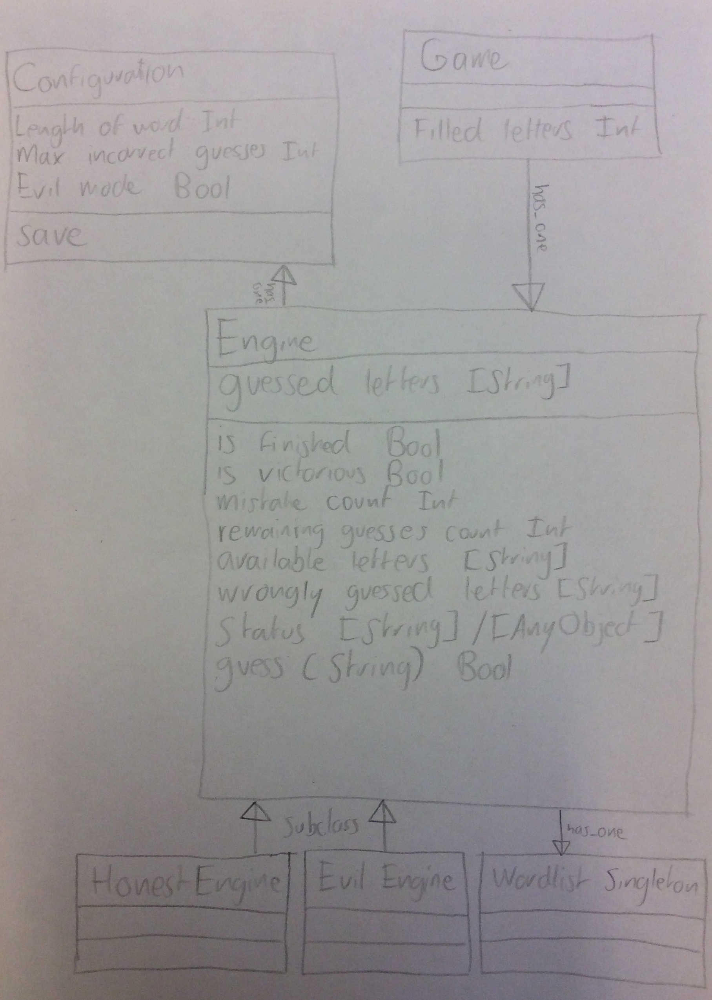

Hangmaaan
=========

A highly configurable, minimalist and possibly evil Hangman implement.

## Features

- [x] Play Hangman on your iPhone
- [ ] Look at fancy letters that show the state of your current game
- [x] Pick the length of the word that you want to guess
- [x] Choose the amount of incorrect guesses that you are allowed to make
- [x] Try the 'evil mode' if you're really good or when you want to get punished
- [x] Check out your detailed high scores
- [x] Restart anytime you want
- [x] Adjust settings for your next game while playing

## Application flow

## Models

## Requirements

### APIs

- NSUserDefaults
