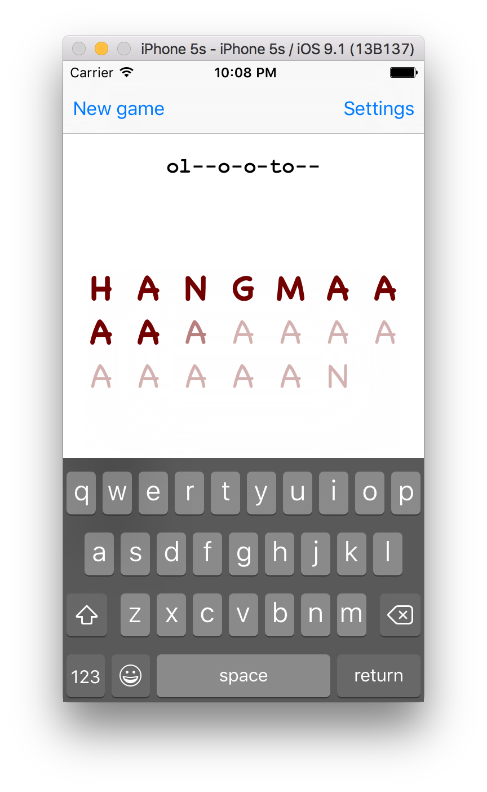
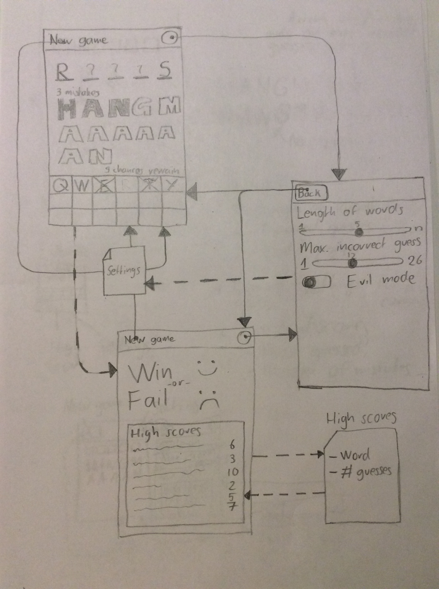
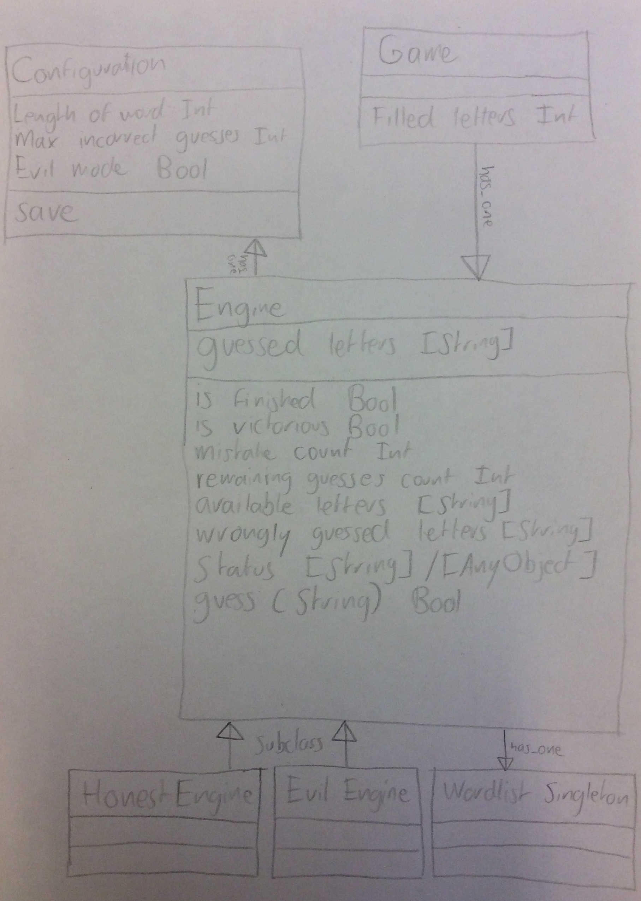
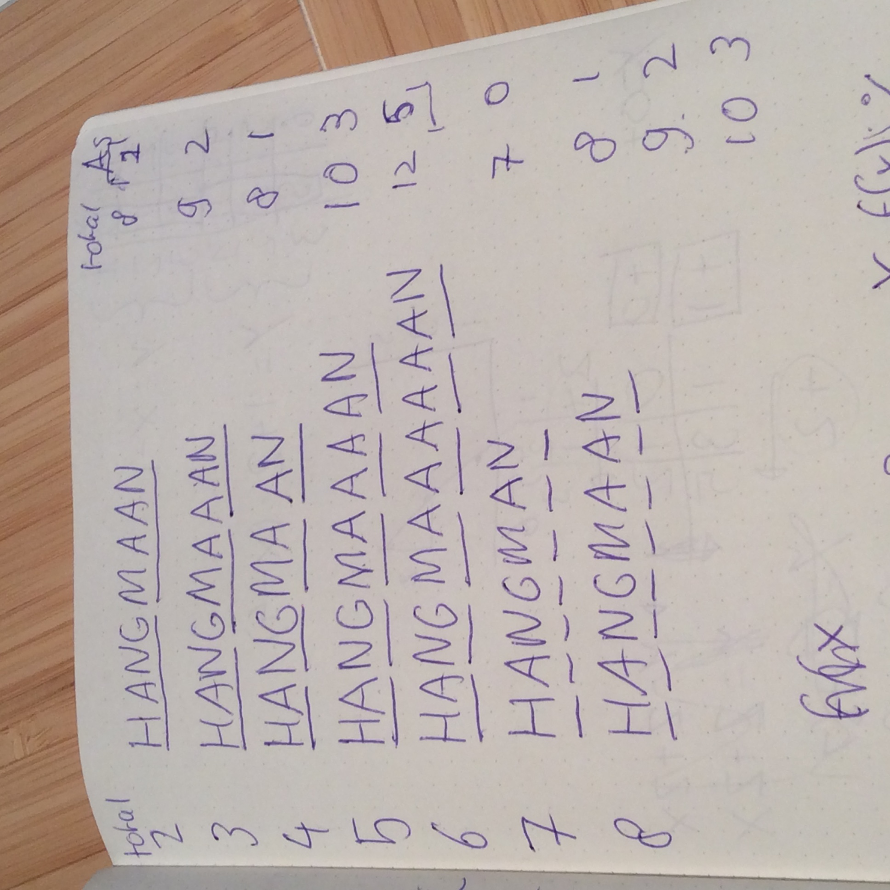

Hangmaaan
=========

A highly configurable, minimalist and possibly evil Hangman implement.

## Features

- [x] Play Hangman on your iPhone
- [x] Look at fancy letters that show the state of your current game
- [x] Pick the length of the word that you want to guess
- [x] Choose the amount of incorrect guesses that you are allowed to make
- [x] Try the 'evil mode' if you're really good or when you want to get punished
- [x] Check out your detailed high scores
- [x] Restart anytime you want
- [x] Adjust settings for your next game while playing

## Requirements

Source: https://apps.mprog.nl/project/proposal

- [x] Immediately upon launch, gameplay must start (unless the app was simply backgrounded, in which case gameplay, if in progress prior to backgrounding, should resume).
- [x] Your app must inform the user of all relevant state for the current game: open letter positions, guessed letters, guesses left, and so on. Be creative on this aspect! If unsure about how to proceed, study some Hangman games that are available in the app store.
- [x] The user must be able to input guesses via an on-screen keyboard.
- [x] Your app must only accept as valid input single alphabetical characters (case-insensitively). Invalid input (e.g., multiple characters, no characters, characters already inputted, punctuation, etc.) should be ignored (silently or with some sort of alert) but not penalized.
Your app’s front side must have a title (e.g., Hangman) or logo as well as navigation to go to the app’s settings and to start a new game.
- [x] If the user guesses every letter in some word before running out of chances, he or she should be somehow congratulated, and gameplay should end (i.e., the game should ignore any subsequent keyboard input). If the user fails to guess every letter in some word before running out of chances, he or she should be somehow consoled, and gameplay should end. The front side’s two buttons should continue to operate.
- [x] A user must be able to configure three settings: the length of words to be guessed (the allowed range for which must be [1,n], where n is the length of the longest word in words.plist or words.xml); the maximum number of incorrect guesses allowed (the allowed range for which must be [1,26]); and whether or not to be evil. By default, your app must be evil. But if the user opts to disable evil, gameplay should occur in a traditional, non-evil way, whereby the app must choose a word pseudorandomly from the start and stay committed to that word until the game’s end.
- [x] When settings are changed, they should only take effect for new games, not one already in progress, if any.
- [x] Your app must maintain a history of high scores that’s displayed anytime a game is won or lost. We leave the definition of “high scores” to you, but you should somehow rank the results of at least 10 games (assuming at least 10 games have been won), displaying for each the word guessed and the number of mistakes made (which is presumably low). The history of high scores should persist even when your app is backgrounded or force-quit.

## Report

### Prototype design

#### Application flow

#### Models

#### Requirements

##### APIs

- NSUserDefaults

### Implementation

The final implementation differs quite a lot from the design.

#### Models

The models have been built by using a test-driven development workflow. Please check out the tests (`HangmanTests/*.swift`) to get a better understanding of the code. The chronological order of implementation is as follows:

1. `Guess`
2. `Engine`
3. `EvilEngine`
4. `HonestEngine`
5. `WordList`
6. `Configuration`
7. `HighscoreList`
8. `Highscore`
9. `Progress`
10. `ProgressSlot`

#### Pièce de résistance

The display of the game state deserves some explanation. The amount of `A`s on the screen is dependent on the amount of maximum incorrect guesses. The (non-)transparency of letters is controlled by the amount of incorrectly guessed letters so far. The tests for the mathematics behind this can be seen in `HangmanTests/ProgressTests.swift`.

